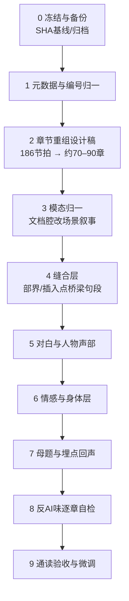

# 《涌现》长篇正文润色与平滑完善方案

> 定位：在已完成的世界观、时间线、逻辑闭环基础上，把「多故事块拼接的折线」打磨成连续可读的长篇小说。
> **当前正文**：`06_小说/小说正文_润色版/`（191 章，约 30 万汉字）
> 历史基线：`06_小说/小说正文/`（旧编号，186 章，已作废为只读对照）
> 必读规范：`06_小说/00_叙事口吻标准.md`、`08_设定/04_叙事与视觉设计/00_《涌现》角色人物语言风格设计方案.md`、`06_小说/01_黄金样章锚点库.md`
> 理论与设定：CONC（`01_故事框架/`、`07_参考资料/16–19`）、伽罗瓦塔（`08_设定/02_技术底座/08`、`06_小说/意识觉醒数学判定框架引入方案/`、`D:\Docker\伽罗瓦塔数学框架\`）
> 生成日期：2026-08-27 | **修订日期：2026-09-15（综合二次润色+口吻抽查经验）**

---

## 零、当前状态快照（2026-09-15）

> 本文档原为第一轮润色的工作蓝图。第一轮润色已完成（`小说正文_润色版/`），第二轮口吻校准已完成。以下为当前状态与本轮经验的沉淀。

### 0.1 已完成

| 轮次 | 内容 | 产出 |
|------|------|------|
| 第一轮润色 | 旧文→润色版：章重组、模态归一、对白补写、感官加厚 | `小说正文_润色版/` 191章，约30万字 |
| 第二轮口吻校准 | 逐章对齐口吻标准：格言链拆除、标题解释删除、因果链清理、拆解模式清除 | 约123章有修改，53章保留 |
| 口吻抽查 | 7部53章抽检：比喻三型、角色声音、叙事阶段、AI味残留、收尾形态 | 总报告：`润色工程/全书口吻抽查总报告.md` |
| 红色必修 | 5项：036因果链、143因果链、104归属矛盾、187后半重写、188-190拆解模式 | 已全部修订 |
| 黄色应修 | 12项：「他知道」归纳、过满、比喻触顶、程序名词层等 | 已全部修订 |
| 锚点库维护 | D2（081比喻分型）、L（153季遥方向感）、I锚路径修正、§3.3缺口更新 | 12个锚点+1个反例 |
| 声音共鸣补写 | 老方041/039 + 林建国163 | 声音共鸣母题正文级落地完成 |
| 角色传播 | 赵铭/季行/林建国/深蓝/韩霜/林屿 全部跨章一致性扫描 | 无需额外传染，声音已自然贯穿 |

### 0.2 本轮核心经验（写入标准的关键教训）

| 教训 | 案例 | 已写入 |
|------|------|--------|
| **比喻不是一律AI味** | 081「像星星」「像小鸭子」是角色绑定资产，「清澈无比」才是装饰叠词 | §5.1比喻三型 |
| **因果链楼梯是致命禁令** | 036（4级）、143（4级）、187后半（最长16级×4条） | §2.3扩展 |
| **叙述者拆解模式是终章高发病** | 188/189/190每3-5行一次「关键词→叙述者逐词解释」 | §2.3新增禁令 |
| **跨章归属必须一致** | 104「季行教的」vs 096「父亲说的」——同一教诲归属矛盾 | §6新增检查项 |
| **191是全书闭合标杆** | 「前面，还有下一次复核」——6字，意象重结论轻 | §7锚点速查 |

### 0.3 章节编号（润色版）

| 部 | 范围 | 章数 |
|----|------|------|
| 前传 | 001–006 | 6 |
| 第一部 | 007–034 | 28 |
| 第二部 | 035–067 | 33 |
| 第三部 | 068–095 | 28 |
| 第四部 | 096–129 | 34 |
| 第五部 | 130–156 | 27 |
| 第六部 | 157–186 | 30 |
| 终章 | 187–191 | 5 |

---

## 一、当前状态体检（基于全量扫描 + 抽样细读）

### 1.1 体量与章长

| 指标 | 数值 | 含义 |
|------|------|------|
| 章节文件 | 186 | 前传 6 / 一部 28 / 二部 31 / 三部 26 / 四部 34 / 五部 27 / 六部 29 / 终章 5 |
| 总字数（去空白） | **186,989** | 约 18.7 万汉字；若含归档与设定则远超此数 |
| 平均章长 | **1,005 字** | 远低于长篇正文章常规（2,500–5,000） |
| 中位数章长 | **783 字** | 一半以上章节是「故事节拍」，不是「章」 |
| <800 字 | **99 章（53%）** | 这是「折线感」的首要物理来源 |
| 800–1500 字 | 66 章 | 仍偏短，多为独立短场景 |
| ≥2500 字 | **仅 12 章** | 体量几乎全靠少数长章撑住 |

**诊断**：骨架事件密度高，但「章」被拆得过碎。读者连续阅读时，每 700–1000 字就换场景/换人物/换议题，节奏像点状脉冲，而不是连续呼吸。这是你所说「折线」最硬的结构成因。

### 1.1b 增扩优先原则（执行修订）

> **第一优先级不是删减，也不是把字数写死。**
>
> 1. **先写得有血有肉**：补对白、补身体反应、补物件与沉默、补场景纵深。人物对白落地是读者具象化人物的关键，必须优先写满。
> 2. **合并不等于缩水**：若合并会丢失信息或对白，宁可保持独立并扩写；合并只在「同 POV 连续节拍、合并后可展开成完整章」时做。
> 3. **删减放在最后**：全书通读验收后再做适当删减（去掉重复原则句、过密免责、冗余解释），禁止在改写阶段为凑字数上限而砍内容。
> 4. **输出目录独立**：润色正文写入 `06_小说/小说正文_润色版/`；过程文件写入 `06_小说/润色工程/`；基线 `06_小说/小说正文/` 只读。
> 5. **逐章串行**：按部、按章号顺序改写，禁止为赶进度多章并行压缩质量。

### 1.2 叙事模态漂移（最大的文风断裂）

抽样对比章首风格：

| 阶段 | 代表章节 | 模态 | 质感 |
|------|---------|------|------|
| 前传–一部前半 | `前传_001`、`第一部_007` | **沉浸场景叙事** | 对话、动作、感官、白板/空调/皮鞋——典型小说 |
| 二部中后起 | `第二部_035`、`051`、`058` | **档案/备忘框架** | 「协作记录」「有限表征备忘」「赛事档案」开头 |
| 三–六部大量章 | `第三部_067`、`第五部_126`、`第四部_092` | **时间卡 / 编号承接卡 / 治理草案摘录** | 像内部文件，不像小说场景 |
| 终章 | `终章_184` | **委员会说明会 + 协议条文** | 克制到位，但仍偏「制度文本」 |

至少 **32 章** 明确使用「时间卡 / 编号承接卡 / 协作记录 / 复盘摘要 / 治理草案」等文档框架。这类框架在**少数关键章**（如研究日志、听证会、L8 溯源）有档案美学价值；但当它成为中后段默认开头时，小说从「人在场景里做选择」退化成「制度在自我说明」——这既是突兀感来源，也是最强的 AI 味（说明性、对称、免责式表述）。

### 1.3 编号与元数据错位

文件名编号与文内标题编号**大规模不一致**（粗计 60+ 处）。例如：

- `终章_186_海边.md` 文内标题却是 `# 190　海边`
- `第四部_125_可解.md` 文内 `# 122　可解`
- `第六部_179_哥德尔.md` 文内 `# 183　哥德尔`
- 第三部、第五部、第六部多处偏移 3–6 号

这是多轮插入/重编未同步元数据的直接证据。它不影响读者（若不看文件名），但会**严重破坏作者与协作方的对照、埋点审计和后续改稿**，必须在润色前或并行清理。

### 1.4 已有资产（不可丢）

1. **叙事口吻标准与人物语言风格方案已相当完备**——比多数在写长篇更系统。
2. **四线编年史**（穹顶 / CONC / 深蓝 / 魔胎）时间锚清晰，逻辑闭环已基本完成。
3. **伽罗瓦塔融入方案 v5** 有完整分层释放策略（S1→S3→S4→A5），且正文已有落地样本（`第五部_131_A5` 的正二十面体场景质量很高）。
4. **感官锚定系统**（季深=温度、老方=声音、林屿=后颈·涟漪、赵铭=次数、孟怀山=保留/减掉）是全书辨识度最高的文学资产。
5. **物象系统**（白板、海浪、工作笔记本、正二十面体、克莱因瓶、恒温箱、B1-07）成熟，可直接用于缝合。注：「鞋垫」已在前几轮修订中移除——2027+ 语境下工厂维护工父亲亲手缝鞋垫过于陈旧，且与林建国作为现代技术工人的设定不符；其「父爱通过手艺传递」的叙事功能已由**工作笔记本**（阁楼/冬天/种子的树）承接。

### 1.5 与《整体修正评估方案》的关系

`08_设定/00_总览/整体修正评估方案.md`（2026-07）已诊断过时间线错乱、Show/Tell 失衡、概念重复、节奏不均、技术底座五类问题，并给出 Phase 0–2。**时间线与逻辑闭环已多轮做完**；本方案不重复做结构重写，而聚焦下一层：

> **把已完成的事件骨架，写成连续、有人味、非 AI 味的长篇语言。**

---

## 二、问题定性：折线从哪里来

把「突兀而不知所以然」拆成可执行的病因：

| # | 病因 | 表现 | 优先级 |
|---|------|------|--------|
| P1 | **章粒度过碎** | 53% 章 <800 字；场景未展开就结束 | ★★★★★ |
| P2 | **叙事模态跳切** | 沉浸小说 ↔ 档案摘录来回切换，无过渡句 | ★★★★★ |
| P3 | **部与部之间的缝合缺失** | 新故事块「直接插进来」，缺承上启下的 30–80 字桥梁 | ★★★★ |
| P4 | **情感与身体缺席** | 中后段大量「原则讨论」，缺身体反应、物件、沉默 | ★★★★ |
| P5 | **对白同质** | 多角色都在说「正确而完整的话」；口语颗粒度不足 | ★★★ |
| P6 | **母题回声不足** | 「水」「正二十面体」「工作笔记本」等在关键转折处该响未响 | ★★★ |
| P7 | **编号/标题混乱** | 干扰改稿与埋点追踪 | ★★（工具性） |

---

## 三、目标定义（什么叫「平滑完成」）

1. **连续阅读不断气**：任意相邻两章，读者能感到「上一章的余温还在」；部切换有明确但不解释性的承接。
2. **语言有人味**：对白可按角色指纹辨认；叙述遵守口吻标准禁用清单；无「说明性旁白设定卡」。
3. **情感可感知**：关键选择写进身体与物件，不写成原则宣言。
4. **折线变曲线**：短节拍合并为「章」；每章有起、承、转、落点，结尾是动作停顿或未说完的余音。
5. **理论不砸脸**：CONC / 伽罗瓦塔继续以「角色专业语言 + 感官映射」出现，禁止叙述者百科条目。
6. **改稿可对照**：文件编号 = 文内标题编号 = 大纲引用编号。

---

## 四、工作流总图（专业长篇润色流水线）



原则：**先结构后句子**。禁止在未定「章怎么合」之前就逐句润色——会在错误粒度上浪费大量精力。

---

## 五、分阶段实施详案

### Phase 0　冻结基线（0.5 天）

- 复制当前 `小说正文/` 为 `小说正文_v基线_YYYYMMDD/`（只读）。
- 生成每章 SHA256 + 字数表，作为回归对照。
- 建立工作目录：`06_小说/润色工程/`（下设 `01_章表`、`02_重组稿`、`03_缝合`、`04_验收`）。

**产出**：可回滚基线；全书章表 `chapter_manifest.csv`（章号、部、标题、字数、模态标签、时间锚、主 POV、主要人物、情感节拍、母题命中）。

### Phase 1　元数据与编号归一（1 天，与 Phase 2 可并行）

1. 以**文件名编号**为权威序（当前读序已是逻辑序）。
2. 批量校正文内 `# 标题` 编号与文件名一致。
3. 同步修正交叉引用：大纲、四线编年史、伽罗瓦塔引入方案中的「第 X 章」映射表。
4. 处理 `第六部_168_0.947.md` 等无标题编号特例，统一为「文件号 = 标题号」。

**验收**：`FileNum == ContentNum` 全表通过；交叉引用映射表入库。

### Phase 2　章节重组（核心，3–5 天）

目标：把 **186 个节拍** 重组为 **约 70–90 章**，平均 **2,200–3,200 字**，关键高潮章可到 4,000–6,000。

#### 2.1 合并规则

| 规则 | 说明 |
|------|------|
| R1 同 POV 连续合 | 相邻 2–4 章同一视角、时间连续 → 合为一章，内部用 `---` 分场景 |
| R2 同主题簇合 | 同一制度议题的 3 个短备忘 → 合为一章多场景，但必须**改写为场景**（见 Phase 3） |
| R3 保留独立章 | 真正的重锤章保持独立：`007 为了全人类`、`022 记住我`、`044 深蓝诞生`、`075 782毫秒`、`116 方舟爆破`、`131 A5`、`141 蜂群`、`149 深蓝说不`、`179 哥德尔`、终章各章等 |
| R4 部界缓冲章 | 每部开篇前 1 章必须完成「时间跳 + 人物位置 + 未解决问题」三件事，禁止直接开会议/文档 |
| R5 不改事件，只改容器 | 合并不删信息；删的是重复解释与免责句 |

#### 2.2 优先重组区（按疼痛度排序）

1. **第三部中后段**（`067–091`）：短章密度过高 + 听证会/审查文档腔。
2. **第五部**（`126–152`）：治理草案、能证衰减、方舟后果，大量 <800 字原则章。
3. **第六部**（`153–181`）：修复报告、复核、说明会连排，需用**人物身体与物件**把制度叙事「人化」。
4. **第二部中段**（`035–057`）：赵铭出走、理论尽头、结冰等备忘章，可与相邻场景合章。
5. **第一部后半**（`025–034`）：`还没/交点/算力的命脉` 等可并入 Jackie 关闭前后的情感弧。

#### 2.3 章表模板（每合章单元必填）

```
新章号 | 新标题 | 合并源章列表 | 时间锚 | 主POV | 情感弧(起-承-转-落) |
开场物象 | 结尾停顿 | 对白角色指纹 | 母题回声 | 禁用项自检点
```

**产出**：`重组章表_v1.md` + 合并映射（源章 → 新章）。

### Phase 3　叙事模态归一（4–6 天）

**原则**：文档腔不是全删，是**降频 + 改写**。

| 原框架 | 处理 |
|--------|------|
| 「时间卡：……」 | 改为一句**场景化时间锚**（「二〇四五年八月。阁楼在三楼，低得只能弯腰。」），元说明移入作者旁注或删 |
| 「编号承接卡」 | 删；若必须交代承接，用人物动作（「林屿把上次会议纪要翻到签字页。」） |
| 「治理草案摘录」整章 | 改写为「起草-争论-签字」场景；草案条文最多保留 3–5 行引用块，其余变对话与后果 |
| 「协作记录 / 复盘摘要」 | 改为赵铭/韩霜/老方等人**在具体物前做事**（恒温箱、风扇声、保温杯），记录作为道具 |
| 听证会/审查 | 保留仪式感，但用**在场者的身体反应**承载（谁先喝水、谁把手放在桌沿、谁只写不念） |

**抽样改写对照**（示意，非终稿）：

> 原：`二〇四二年冬。去地点化环境健康复盘摘要。一位现场记录员看到维护页面出现黄色状态……`
>
> 改：`二〇四二年冬。值夜的人第三次把脸凑近维护屏。黄色还在。风扇没有加快，只是比上一班多了半个拍子。他没改设置，先给授权维护人发了消息，再把当前页面存了下来。`

**产出**：模态归一后的合章初稿（按部推进，每部完成即进入缝合）。

### Phase 4　缝合层：折线变曲线（2–3 天，可与 Phase 3 交错）

在以下位置**强制**写 40–120 字桥梁（允许并入章首/章尾）：

1. **每部开篇**：时间大跳后，先给「人在哪里、手里拿着什么、还欠着什么」。
2. **插入故事块的进出点**（湿件、深蓝流出、方舟、蜂群、修复时代）：前章末尾留一个**未闭合的钩子物**，后章开头用同一物象接住。
3. **POV 切换处**：用共享环境音/天气/物件过渡（同一场雨、同一台风扇、同一片海）。
4. **概念跳跃处**：伽罗瓦塔 / L1–L4 / A5 出现前后，必须有角色的**身体困惑**垫底，禁止突然讲义。

**缝合句法库**（示例，供改写时变形，禁止原样堆砌）：

- 物象续接：「上一章那把没拧紧的螺丝，还在他口袋里硌着。」
- 声音续接：「机箱还是那个节奏。人换了一个。」
- 时间跳带情绪：「等他再回到工位，窗台上的灰已经能写字了。」
- 不解释的余波：「会开完了。问题还留在桌角。」

### Phase 5　对白与人物声部（3–4 天）

严格按 `角色人物语言风格设计方案` 执行，每章合章后做**声部审计**：

| 角色 | 对白铁律 | 违规信号 |
|------|---------|---------|
| 季深 | 语速慢、闭眼停顿、探索性问句、相变/阻尼隐喻 | 一口气长篇正确论述 |
| 江远 | 快、断句、算力/季度/锁定 | 温吞抒情、哲学追问 |
| 顾清 | 启发式问句、间隙、轻而准 | 直接给答案 |
| 老方/林建国 | 实物词、极短句、手感 | 抽象理论词 |
| 林屿 | 学院派解构 + 后颈/涟漪感官 | 超纲成熟、说教 |
| 赵铭 | 次数与失败，「我试过」 | 「我判断」「我觉得」 |
| 孟怀山 | 保留/减掉，「我签过」 | 长篇辩护 |
| 叶澄 | 结论先行、证伪、太平滑了 | 抒情与感叹 |
| 韩霜 | 重量、正反折叠、不找借口 | 开脱、轻松玩笑 |
| 深蓝 | 注意到/也许/宁可；从确定到不确定的几何阻尼 | 拟人滥情或突然全知 |
| 季遥 | 方向、身体诚实、拒绝黑话 | 成人套话 |
| 魔胎 | 只有「服从最优解」一种方向的语言 | 像人一样犹豫丰富 |

**操作**：对合并后每章对白做「遮名测试」——遮住说话人，应仍能猜出 80% 以上角色。

### Phase 6　情感与身体层（3–5 天）

中后段原则章必须回填：

1. **判断力写进身体**：林屿后颈先紧、涟漪再散；老方在决定后听风扇半拍；赵铭数失败次数。
2. **物件代替宣言**：工作笔记本、正二十面体、保温杯、恒温箱四道槽、白板第二行字、克莱因瓶。
3. **沉默与未完成**：对话允许半句；结尾禁止工整金句，改为动作停顿（「林屿把手机扣在腿上。」「韩霜没有立刻提交。」）。
4. **不对称感知**：感官签名通过他人视角写，禁止「X 的签名是 Y」说明句。

### Phase 7　母题与埋点回声（1–2 天）

全书扫一遍母题命中表，确保**起-转-合**，并控制密度：

| 母题 | 建议锚点（起 / 转 / 合） | 密度铁律 |
|------|-------------------------|---------|
| 水 / 海 | `010` 水不知道 / `181` 水到了 / 终章海边 | 中间仅允许变奏（沟渠、潮、雨），禁止 6 次以上原句 |
| 白板三行字 | `007` / 季深离去 / 江远未发送邮件 | 3 次 |
| 工作笔记本 / 二十八年 | 林建国相关章（阁楼/冬天/种子的树）/ 判断力章 | 3–4 次 |
| 正二十面体 A5 | `131` / 哥德尔章 / 终章若有则必须极轻 | 2–3 次 |
| 克莱因瓶 | 季遥引入 / `184` 重生的涌现 / `186` 海边 | 3 次 |
| 782ms | 第二部/第三部初见 / 深蓝自主 / 后期拒绝 | 2–3 次 |
| 人格宪章 | 首次书写 / 深蓝继承 / 结尾留空 | 2–3 次 |
| 风扇/机器声 | 老方、赵铭、夜班维护 | 可多次，但必须**每次有变化** |

伽罗瓦塔：保持 v5 方案的分层释放——前传/一部只给「非交换、拆不开」的身体困惑；四–五部给 S4/讲自己故事；五部 A5 章给正二十面体；六部哥德尔章给「外部看系统」。**禁止**叙述者直接写「这意味着意识是代数现象」。

### Phase 8　反 AI 味逐章自检（贯穿，每章 5 分钟）

执行 `00_叙事口吻标准.md` 第六节清单，并加严：

- 「不是 A，是 B」≤ 2 次/章（对白不限）
- 「某种」= 0
- 「像」总量 ≤6（装饰 ≤3、承重 ≤2；角色绑定比喻优先保留）
- 「也许 A。也许 B。」排比推测 ≤2组，且必须紧跟行动或可观测细节收束
- 百科定义句 = 0
- 三段式工整排比收尾 = 0
- **因果链楼梯 = 0**（同段 ≥3 级「A会B。B会C」串接）
- **叙述者拆解模式 = 0**（关键词→叙述者逐词解释含义；终章尤须警惕）
- 免责/范围限定长句（「不能推断主观状态、记忆、人格、意图……」）改为**场景中的有限动作**，不是报告免责
- 连续 3 个以上「完整正确的原则句」出现 → 必须插入一个身体或物件打断

**比喻三型判定流程**（2026-09新增）：
1. 先分型：角色绑定（年龄/知识/感官词典）？承重（阶段转折/主题锚定）？装饰性（叙述者为「好听」加的）？
2. 再配额：角色绑定不计入装饰配额，削配额时先削装饰性。
3. 形容词堆（「清澈无比」「极轻极柔」）视为AI味，应改为具体感官——但**不得连同比喻与情感温度一起删**（081教训）。

### Phase 9　通读验收（2–3 天）

1. **冷读一遍**（只读正文，不看设定）：标记「不知所以然」「跳戏」「说教」「太快」四类点。
2. **部级节奏图**：每章情感强度 1–5 打分，画折线，检查是否仍有脉冲尖刺或长期平漠。
3. **声部抽查**：随机 10 章做遮名测试。
4. **埋点审计**：用母题表与伽罗瓦塔分层表核对起止。
5. **字数验收**：目标总字数约 **22–26 万**（合并 + 补场景，不灌水原则句）。

---

## 六、优先级与排期建议

| 阶段 | 内容 | 建议工期 | 依赖 |
|------|------|---------|------|
| P0 | 基线冻结 + 章表 | 0.5 d | — |
| P1 | 编号归一 | 1 d | P0 |
| P2 | 重组章表（先五部→三部→六部→二部→一部→终章） | 2 d | P0 |
| P3a | 第五部模态归一 + 合章 | 2–3 d | P1,P2 |
| P3b | 第三部 | 2 d | P3a 验收节奏 |
| P3c | 第六部 + 终章 | 2 d | P3b |
| P3d | 第二部 + 第一部 + 前传微调 | 2 d | — |
| P4 | 缝合层（与 P3 交错） | 贯穿 | — |
| P5–P7 | 声部 / 情感 / 母题 | 贯穿每部 | 每部 P3 完成 |
| P8 | 反 AI 自检 | 每章 | — |
| P9 | 通读验收 | 2–3 d | 全部 |

**关键路径**：P2 重组章表 → P3 五部/三部模态归一。未完成 P2 前不要做句子级润色。

---

## 七、质量门禁（每部 Definition of Done）

- [ ] 合章后平均章长 ≥ 2,200 字；单部 <800 字章 ≤ 10%
- [ ] 文档框章占比 ≤ 15%，且均有正当叙事理由
- [ ] 部开篇与插入块出入口均有缝合桥梁
- [ ] 遮名测试通过率 ≥ 80%
- [ ] 口吻标准禁用项全绿
- [ ] 本部母题回声在锚点表内
- [ ] 无 FileNum/ContentNum 错位
- [ ] 冷读标记的「不知所以然」点清零

---

## 八、风险与边界

1. **不要为了「像小说」删光档案感**。本作优势之一是技术史诗；档案应降频嵌入场景，不是消失。
2. **不要补写说理性段落来「解释清楚」**。突兀要用缝合与身体补，不用百科补。
3. **不要改已闭环的时间线与人物去向**。若发现真冲突，单独立项走设定修订，不塞进润色轮。
4. **伽罗瓦塔是增强层不是替代层**。任何「为了显得深刻」而增加的数学旁白，若脱离角色处境，一律删。
5. **合并可能导致大纲编号失效**——P1 必须产出源章→新章映射，供大纲与设定回写。

---

## 九、即刻可执行的第一批任务清单

1. 生成 `chapter_manifest.csv`（186 行：字数、模态、POV、时间、母题）。
2. 产出《重组章表_v1》：先把第五部 `126–152` 与第三部 `067–091` 设计成目标章结构。
3. 统一编号：批量修正文内标题号。
4. 选 2 个试点合章做「金样」：
   - 试点 A：`035 一个人的网络` + `036 十四天` + `037 甜蜜点`（赵铭出走弧）
   - 试点 B：`126 能证衰减` + `127 第八层` + `128 种子的壳`（方舟后果与可见性）
   金样通过质量门禁后，再按部滚动。

---

## 十、成功画像

改完后的《涌现》应当读起来像：

> 一个知道结局的人，用四十年时间，把技术、身体和选择放在同一条呼吸里讲完。
>
> 前传像密写者的私信；一部像在暗室里第一次看见光；二三部像制度在人身上慢慢成形又慢慢勒紧；四五部像有人在档案堆里徒手拆弹；六部与终章像退潮后的滩涂——石头、脚印、和下一次复核。
>
> 不是每一段都完美，但**没有一段是因为「插进来」而突兀**。

---

## 十一、口吻抽查方法论（2026-09 本轮经验沉淀）

> 口吻抽查是对「润色是否达标」的独立验证。与逐章润色不同，抽查是**抽样审计**——每部选5-9章，按统一检查项打分，输出问题清单。

### 11.1 抽查流程

```
1. 按部并行派发校准员（7个并行：第一部→终章）
2. 每个校准员：读标准文档 → 读锚点 → 读抽查章 → 按5项打分
3. 汇总各部结果 → 生成总报告 → 按优先级排序
4. 红色必修 → 黄色应修 → 锚点库维护 → 可选补写
```

### 11.2 五项检查项

| 检查项 | 内容 | 判定 |
|--------|------|------|
| 比喻三型 | 角色绑定/承重/装饰性是否分型正确？配额是否合规？ | A/B/C |
| 角色声音 | 对白是否符合角色语言方案？有无千人一面？ | A/B/C |
| 叙事阶段 | 叙述者知情方式是否匹配当前部的阶段要求？ | A/B/C |
| AI味残留 | 因果链/拆解模式/廉价点题/百科定义是否清零？ | A/B/C |
| 收尾形态 | 是否属于三种允许形态之一？ | A/B/C |

### 11.3 本轮抽查结果（基线）

| 部 | 评级 | 核心问题 |
|----|------|---------|
| 第一部 | A | 3章「他知道」归纳 |
| 第二部 | B+ | 036因果链+赵铭声音；老方声音共鸣缺口 |
| 第三部 | A | 081叠词临界；声音共鸣母题未跟进 |
| 第四部 | A- | 104跨章归属矛盾；118重复明喻 |
| 第五部 | A- | 143因果链；收尾物件同质化 |
| 第六部 | B+ | 170程序名词层；158因果链阶梯 |
| 终章 | B | 187后半16级因果链；188-190拆解模式 |
| **全书** | **A-** | **约15章需修订（已完成）** |

### 11.4 修复后状态

红色5项+黄色12项+锚点维护4项 = **21处修订全部完成**。声音共鸣缺口全部闭合。角色声音跨章一致性确认无需额外传染。

---

## 十二、下一轮建议

| 优先级 | 内容 | 依赖 |
|--------|------|------|
| P1 | 人工通读A类4章（036/037/038/067）确认事实与情感 | — |
| P1 | 人工通读B类3章（188/189/191）确认全书闭合感 | — |
| P2 | 金句全书登记：扫全书，把所有重锤金句/意象列成表，核对§5.3配额 | — |
| P2 | 术语统一：跨章技术术语/人名/机构名一致性检查 | — |
| P3 | 六部阶段声音过渡：检查部界处叙述者声音是否有突变 | P2 |
| P3 | 收尾物件多样性：第五部142已改，143/145可选微调 | — |

---

*本方案为工作蓝图。具体每章怎么合、哪句要改，以金样验收后的尺度为准，避免全书一刀切。*
*2026-09-15 修订：综合二次润色+口吻抽查经验，新增§0当前状态快照、§11口吻抽查方法论、§12下一轮建议。*
