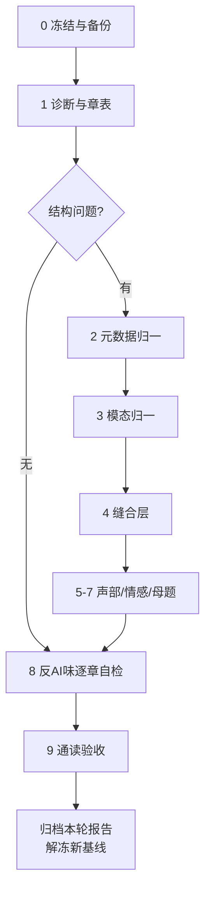

# 《涌现》长篇正文润色与平滑完善方案（标准流程版）

> **定位**：本文件是《涌现》长篇润色的**长期标准流程**，不依赖任何一轮正文的具体结构或章号。每次正文改动后，可直接以本文件为工作蓝图启动新一轮润色迭代。
> **配套规范**（必读，本文件不重复其细则）：
> - `06_小说/00_叙事口吻标准.md` —— 叙述者、比喻、金句、感官母题、术语现状、技术白名单
> - `06_小说/01_黄金样章锚点库.md` —— few-shot 锚点与蒸馏摘录
> - `08_设定/04_叙事与视觉设计/00_《涌现》角色人物语言风格设计方案.md` —— 角色语言风格
>
> **修订日期**：2026-09-16（自足化改造：剥离历史快照，流程通用化）
> **历史轮次记录**见文末附录 A，仅作参考，不约束后续迭代。

---

## 零、适用范围与迭代模型

### 0.1 适用范围

| 场景 | 是否适用本方案 |
|------|---------------|
| 新增/改写章节后的全书或分部润色 | 适用 |
| 某一叙事问题专项修复（如 AI 味残留、对白同质） | 适用（取对应 Phase） |
| 世界观/时间线/人物去向的结构性修订 | **不适用** —— 单独立项走设定修订，不塞进润色轮 |
| 单章微调（错字、标点、单句） | 不适用 —— 直接改，改后更新备份即可 |

### 0.2 迭代模型

每一轮润色都是独立闭环：

```
冻结基线 → 诊断 → 分阶段修复 → 门禁验收 → 归档本轮报告 → 解冻为新基线
```

- **禁止跨轮未归档就叠加修改**：上一轮未出验收报告，不启动下一轮。
- **禁止在未诊断前就逐句润色**：先定位问题类型与范围，再选 Phase。
- **禁止为凑字数或赶进度并行压缩质量**：逐章串行，关键章人工定稿。

---

## 一、核心原则（每轮必守）

### 1.1 增扩优先

1. **先写得有血有肉**：补对白、补身体反应、补物件与沉默、补场景纵深。人物对白落地是读者具象化人物的关键。
2. **合并不等于缩水**：若合并会丢失信息或对白，宁可保持独立并扩写；合并只在「同 POV 连续节拍、合并后可展开成完整章」时做。
3. **删减放在最后**：全书通读验收后再做适当删减（重复原则句、过密免责、冗余解释），禁止在改写阶段为凑字数上限而砍内容。

### 1.2 先结构后句子

禁止在未确认「章怎么合、模态怎么归一」之前就逐句润色——会在错误粒度上浪费精力。若本轮无结构问题，可跳过 Phase 1–2，直接进入句子级。

### 1.3 目录与备份纪律

| 目录 | 用途 |
|------|------|
| 当前正文目录（本轮开始时的路径） | 唯一权威正文 |
| `06_小说/润色工程/` | 过程文件、报告、备份 |
| 上一轮基线备份 | 只读，禁止直接改 |

每轮 Phase 0 必须产出可回滚基线；验收通过后，新基线替换旧基线。

### 1.4 不改设定，只改容器与语言

- 不改已闭环的时间线、人物去向、硬设定（伽罗瓦塔边界、782ms、A₅ 等）。
- 若发现真冲突，单独立项走设定修订，**不塞进润色轮**。
- 档案感不是全删，是降频嵌入场景。

---

## 二、问题诊断库（折线/突兀从哪里来）

> 每轮诊断时，按本库给问题分类定性，再选对应 Phase。表现与优先级可按本轮实测调整。

| # | 病因 | 典型表现 | 对应 Phase | 优先级 |
|---|------|---------|-----------|--------|
| P1 | **章粒度过碎** | 大量短章（<800 字）；场景未展开就结束 | Phase 2 重组 | ★★★★★ |
| P2 | **叙事模态跳切** | 沉浸小说 ↔ 档案/备忘/治理草案来回切换，无过渡 | Phase 3 模态归一 | ★★★★★ |
| P3 | **缝合缺失** | 部界/插入点/POV 切换处「直接插进来」 | Phase 4 缝合 | ★★★★ |
| P4 | **情感与身体缺席** | 原则讨论无身体反应、物件、沉默 | Phase 6 情感层 | ★★★★ |
| P5 | **对白同质** | 多角色都在说「正确而完整的话」；遮名猜不出 | Phase 5 声部 | ★★★ |
| P6 | **母题回声不足** | 关键转折处该响的物象未响 | Phase 7 母题 | ★★★ |
| P7 | **编号/元数据错位** | 文件号 ≠ 文内标题号 ≠ 大纲引用号 | Phase 1 元数据 | ★★（工具性） |
| P8 | **AI 味残留** | 因果链楼梯、叙述者拆解、「极其」叠词、百科定义 | Phase 8 自检 | ★★★★ |
| P9 | **跨章归属矛盾** | 同一教诲/金句在 A 章归父亲、B 章归他人 | Phase 8 + 通读 | ★★★★ |

---

## 三、目标定义（什么叫「平滑完成」）

1. **连续阅读不断气**：任意相邻两章，读者能感到「上一章的余温还在」；部切换有明确但不解释性的承接。
2. **语言有人味**：对白可按角色指纹辨认；叙述遵守口吻标准禁用清单；无「说明性旁白设定卡」。
3. **情感可感知**：关键选择写进身体与物件，不写成原则宣言。
4. **折线变曲线**：短节拍若保留，每章仍有起、承、转、落点；结尾是动作停顿或未说完的余音。
5. **理论不砸脸**：CONC / 伽罗瓦塔以「角色专业语言 + 感官映射」出现，禁止叙述者百科条目。
6. **改稿可对照**：文件编号 = 文内标题编号 = 大纲引用编号。

---

## 四、工作流总图



- **Phase 1–2 为条件步骤**：仅当诊断发现结构问题（P1/P7）时执行。
- **Phase 5–7 可交错**：按部推进时，每部模态归一完成后立即做声部/情感/母题。
- **Phase 8 贯穿全程**：每章改完即自检，不留到最后。

---

## 五、分阶段实施详案

### Phase 0　冻结基线（0.5 天）

1. 复制当前正文目录为 `06_小说/润色工程/backup_正文_YYYYMMDD_HHMMSS/`（只读）。
2. 生成每章 SHA256 + 字数表，作为回归对照。
3. 建立本轮工作目录：`06_小说/润色工程/润色轮_YYYYMMDD/`（下设 `01_章表`、`02_重组稿`、`03_缝合`、`04_验收`）。

**产出**：可回滚基线；全书章表 `chapter_manifest.csv`（章号、部、标题、字数、模态标签、时间锚、主 POV、主要人物、情感节拍、母题命中）。

### Phase 1　诊断与章表（1 天）

1. 全量扫描：字数分布、模态标签（沉浸/档案/备忘/治理草案/时间卡）、编号一致性。
2. 抽样细读：每部 3–5 章，按问题诊断库（§二）打标。
3. 产出本轮问题清单：按 P1–P9 分类，每类列出涉及章与优先级。
4. 决定本轮范围：结构轮（含 Phase 2–4）还是语言轮（跳过 2–4）。

**产出**：`诊断报告_YYYYMMDD.md` + `chapter_manifest.csv`。

### Phase 2　元数据与编号归一（条件步骤，1 天）

1. 以**文件名编号**为权威序。
2. 批量校正文内 `# 标题` 编号与文件名一致。
3. 同步修正交叉引用：大纲、编年史、引入方案中的「第 X 章」映射表。
4. 无标题编号特例统一为「文件号 = 标题号」。

**验收**：`FileNum == ContentNum` 全表通过；交叉引用映射表入库。

### Phase 2b　章节重组（条件步骤，仅当 P1 成立）

> 若本轮诊断无章粒度问题，**跳过本 Phase**。

**合并规则**：

| 规则 | 说明 |
|------|------|
| R1 同 POV 连续合 | 相邻 2–4 章同一视角、时间连续 → 合为一章，内部用 `---` 分场景 |
| R2 同主题簇合 | 同一制度议题的多个短备忘 → 合为一章多场景，但必须改写为场景（见 Phase 3） |
| R3 保留独立章 | 真正的重锤章保持独立（阶段转折、主题锚定、全书闭合章） |
| R4 部界缓冲章 | 每部开篇前 1 章必须完成「时间跳 + 人物位置 + 未解决问题」三件事，禁止直接开会议/文档 |
| R5 不改事件，只改容器 | 合并不删信息；删的是重复解释与免责句 |

**章表模板**（每合章单元必填）：

```
新章号 | 新标题 | 合并源章列表 | 时间锚 | 主POV | 情感弧(起-承-转-落) |
开场物象 | 结尾停顿 | 对白角色指纹 | 母题回声 | 禁用项自检点
```

**产出**：`重组章表_v1.md` + 合并映射（源章 → 新章）。

### Phase 3　叙事模态归一（按问题章范围）

**原则**：文档腔不是全删，是**降频 + 改写**。

| 原框架 | 处理 |
|--------|------|
| 「时间卡：……」 | 改为一句场景化时间锚（「二〇四五年八月。阁楼在三楼，低得只能弯腰。」），元说明移入作者旁注或删 |
| 「编号承接卡」 | 删；若必须交代承接，用人物动作（「林屿把上次会议纪要翻到签字页。」） |
| 「治理草案摘录」整章 | 改写为「起草-争论-签字」场景；草案条文最多保留 3–5 行引用块，其余变对话与后果 |
| 「协作记录 / 复盘摘要」 | 改为角色在具体物前做事（恒温箱、风扇声、保温杯），记录作为道具 |
| 听证会/审查 | 保留仪式感，但用在场者的身体反应承载（谁先喝水、谁把手放在桌沿、谁只写不念） |

**改写对照示意**：

> 原：`二〇四二年冬。去地点化环境健康复盘摘要。一位现场记录员看到维护页面出现黄色状态……`
>
> 改：`二〇四二年冬。值夜的人第三次把脸凑近维护屏。黄色还在。风扇没有加快，只是比上一班多了半个拍子。他没改设置，先给授权维护人发了消息，再把当前页面存了下来。`

### Phase 4　缝合层：折线变曲线

在以下位置**强制**写 40–120 字桥梁（允许并入章首/章尾）：

1. **每部开篇**：时间大跳后，先给「人在哪里、手里拿着什么、还欠着什么」。
2. **插入故事块的进出点**：前章末尾留一个未闭合的钩子物，后章开头用同一物象接住。
3. **POV 切换处**：用共享环境音/天气/物件过渡（同一场雨、同一台风扇、同一片海）。
4. **概念跳跃处**：伽罗瓦塔 / L1–L5 / A₅ 出现前后，必须有角色的身体困惑垫底，禁止突然讲义。

**缝合句法库**（供改写时变形，禁止原样堆砌）：

- 物象续接：「上一章那把没拧紧的螺丝，还在他口袋里硌着。」
- 声音续接：「机箱还是那个节奏。人换了一个。」
- 时间跳带情绪：「等他再回到工位，窗台上的灰已经能写字了。」
- 不解释的余波：「会开完了。问题还留在桌角。」

### Phase 5　对白与人物声部

每章改写后做**声部审计**。下表为自足铁律，不依赖外部文档路径：

| 角色 | 对白铁律 | 违规信号 |
|------|---------|---------|
| 季深 | 语速慢、闭眼停顿、探索性问句、相变/阻尼隐喻 | 一口气长篇正确论述 |
| 江远 | 快、断句、算力/季度/锁定 | 温吞抒情、哲学追问 |
| 顾清 | 启发式问句、间隙、轻而准 | 直接给答案 |
| 老方/林建国 | 实物词、极短句、手感 | 抽象理论词 |
| 林屿 | 学院派解构 + 后颈/涟漪感官 | 超纲成熟、说教 |
| 赵铭 | 次数与失败，「我试过」 | 「我判断」「我觉得」 |
| 孟怀山 | 保留/减掉，「我签过」 | 长篇辩护 |
| 叶澄 | 结论先行、证伪、「太平滑了」 | 抒情与感叹 |
| 韩霜 | 重量、正反折叠、不找借口 | 开脱、轻松玩笑 |
| 深蓝 | 注意到/也许/宁可；从确定到不确定的几何阻尼 | 拟人滥情或突然全知 |
| 季遥 | 方向、身体诚实、拒绝黑话 | 成人套话 |
| 魔胎 | 只有「服从最优解」一种方向的语言 | 像人一样犹豫丰富 |

**操作**：对每章对白做「遮名测试」——遮住说话人，应仍能猜出 80% 以上角色。

### Phase 6　情感与身体层

原则章/制度章必须回填：

1. **判断力写进身体**：林屿后颈先紧、涟漪再散；老方在决定后听风扇半拍；赵铭数失败次数。
2. **物件代替宣言**：工作笔记本、正二十面体、保温杯、恒温箱、白板、克莱因瓶。
3. **沉默与未完成**：对话允许半句；结尾禁止工整金句，改为动作停顿。
4. **不对称感知**：感官母题通过他人视角写，禁止「X 的签名是 Y」说明句（详见口吻标准 §3.3）。

### Phase 7　母题与埋点回声

全书扫一遍母题命中表，确保起-转-合，并控制密度：

| 母题 | 建议锚点（起 / 转 / 合） | 密度铁律 |
|------|-------------------------|---------|
| 水 / 海 | 「水不知道自己会流向哪里」/「水到了」/ 终章海边 | 中间仅允许变奏（沟渠、潮、雨），禁止 6 次以上原句 |
| 白板三行字 | 为了全人类 / 季深离去 / 江远未发送邮件 | 3 次 |
| 工作笔记本 / 二十八年 | 林建国相关章（阁楼/冬天/种子的树）/ 判断力章 | 3–4 次 |
| 正二十面体 A₅ | A₅ 章 / 哥德尔章 / 终章若有则必须极轻 | 2–3 次 |
| 克莱因瓶 | 季遥引入 / 重生的涌现 / 海边 | 3 次 |
| 782ms | 第二部/第三部初见 / 深蓝自主 / 后期拒绝 | 2–3 次 |
| 人格宪章 | 首次书写 / 深蓝继承 / 结尾留空 | 2–3 次 |
| 风扇/机器声 | 老方、赵铭、夜班维护 | 可多次，但必须每次有变化 |

**伽罗瓦塔分层释放**（保持，不依赖具体章号）：前传/一部只给「非交换、拆不开」的身体困惑；四–五部给 S₄/讲自己故事；五部 A₅ 章给正二十面体；六部哥德尔章给「外部看系统」。**禁止**叙述者直接写「这意味着意识是代数现象」。

### Phase 8　反 AI 味逐章自检（贯穿，每章 5 分钟）

执行 `00_叙事口吻标准.md` §6 自检清单，并加严：

- 「不是 A，是 B」≤ 2 次/章（对白不限）
- 「某种」= 0
- 「像」总量 ≤6（装饰 ≤3、承重 ≤2；角色绑定比喻优先保留）
- 「极其 X、极其 Y」叠词 = 0（须换成可触摸细节）
- 「也许 A。也许 B。」排比推测 ≤2 组，且必须紧跟行动或可观测细节收束
- 百科定义句 = 0
- 三段式工整排比收尾 = 0
- **因果链楼梯 = 0**（同段 ≥3 级「A会B。B会C」串接）
- **叙述者批量拆解 = 0**（单次意象回收 ≤1 处/章，见口吻标准 §2.3）
- 免责/范围限定长句改为场景中的有限动作，不是报告免责
- 连续 3 个以上「完整正确的原则句」出现 → 必须插入一个身体或物件打断
- **跨章归属**：本章引用的教诲/金句/判断，人物归属是否与其他章一致

**比喻三型判定流程**：
1. 先分型：角色绑定（年龄/知识/感官词典）？承重（阶段转折/主题锚定）？装饰性（叙述者为「好听」加的）？
2. 再配额：角色绑定不计入装饰配额，削配额时先削装饰性。
3. 形容词堆视为 AI 味，应改为具体感官——但**不得连同比喻与情感温度一起删**。

### Phase 9　通读验收（2–3 天）

1. **冷读一遍**（只读正文，不看设定）：标记「不知所以然」「跳戏」「说教」「太快」四类点。
2. **部级节奏图**：每章情感强度 1–5 打分，画折线，检查是否仍有脉冲尖刺或长期平漠。
3. **声部抽查**：随机 10 章做遮名测试。
4. **埋点审计**：用母题表与伽罗瓦塔分层表核对起止。
5. **字数验收**：按本轮诊断目标核对（结构轮看合并后平均章长；语言轮看是否灌水）。

**产出**：`验收报告_YYYYMMDD.md`（问题清单 + 修订记录 + 遗留项）。

---

## 六、质量门禁（每部 Definition of Done）

- [ ] 若本轮含重组：合章后平均章长达标；单部 <800 字章占比 ≤ 10%
- [ ] 文档框章占比 ≤ 15%，且均有正当叙事理由
- [ ] 部开篇与插入块出入口均有缝合桥梁
- [ ] 遮名测试通过率 ≥ 80%
- [ ] 口吻标准禁用项全绿（含「极其」叠词、因果链、批量拆解）
- [ ] 本部母题回声在锚点表内
- [ ] 无 FileNum/ContentNum 错位
- [ ] 冷读标记的「不知所以然」点清零
- [ ] 跨章归属无矛盾

---

## 七、风险与边界

1. **不要为了「像小说」删光档案感**。本作优势之一是技术史诗；档案应降频嵌入场景，不是消失。
2. **不要补写说理性段落来「解释清楚」**。突兀要用缝合与身体补，不用百科补。
3. **不要改已闭环的时间线与人物去向**。若发现真冲突，单独立项走设定修订。
4. **伽罗瓦塔是增强层不是替代层**。任何「为了显得深刻」而增加的数学旁白，若脱离角色处境，一律删。
5. **合并可能导致大纲编号失效**——必须产出源章→新章映射，供大纲与设定回写。
6. **口吻标准与本方案冲突时，以口吻标准为准**——本方案管流程，口吻标准管语言判定。

---

## 八、口吻抽查方法论（独立验证，可单独执行）

> 抽查是对「润色是否达标」的抽样审计，与逐章润色不同。每部选 5–9 章，按统一检查项打分。

### 8.1 抽查流程

```
1. 按部并行派发校准员
2. 每个校准员：读口吻标准 → 读锚点摘录 → 读抽查章 → 按5项打分
3. 汇总各部结果 → 生成总报告 → 按优先级排序
4. 红色必修 → 黄色应修 → 锚点库维护 → 可选补写
```

### 8.2 五项检查项

| 检查项 | 内容 | 判定 |
|--------|------|------|
| 比喻三型 | 角色绑定/承重/装饰性是否分型正确？配额是否合规？ | A/B/C |
| 角色声音 | 对白是否符合角色语言方案？有无千人一面？ | A/B/C |
| 叙事阶段 | 叙述者知情方式是否匹配当前部的阶段要求？ | A/B/C |
| AI 味残留 | 因果链/拆解模式/廉价点题/百科定义/「极其」叠词是否清零？ | A/B/C |
| 收尾形态 | 是否属于三种允许形态之一（动作停顿/未说完余音/重锤金句）？ | A/B/C |

### 8.3 评级处置

| 等级 | 处置 |
|------|------|
| A | 保持；可升格为锚点候选 |
| A-/B+ | 黄色应修，列入本轮或下轮 |
| B 及以下 | 红色必修，本轮必须完成 |

---

## 九、单轮标准排期（参考）

| 阶段 | 内容 | 建议工期 |
|------|------|---------|
| P0 | 基线冻结 | 0.5 d |
| P1 | 诊断与章表 | 1 d |
| P2 | 元数据归一（若需） | 1 d |
| P2b | 重组章表（若需） | 2 d |
| P3 | 模态归一（按部滚动） | 每部 1–3 d |
| P4 | 缝合层（与 P3 交错） | 贯穿 |
| P5–P7 | 声部 / 情感 / 母题 | 每部 P3 完成后 |
| P8 | 反 AI 自检 | 每章 |
| P9 | 通读验收 | 2–3 d |

**关键路径**：P1 诊断 → 决定是否结构轮 → P3 按部推进。语言轮可压缩为 P0→P1→P8→P9。

---

## 十、成功画像

改完后的《涌现》应当读起来像：

> 一个知道结局的人，用四十年时间，把技术、身体和选择放在同一条呼吸里讲完。
>
> 前传像密写者的私信；一部像在暗室里第一次看见光；二三部像制度在人身上慢慢成形又慢慢勒紧；四五部像有人在档案堆里徒手拆弹；六部与终章像退潮后的滩涂——石头、脚印、和下一次复核。
>
> 不是每一段都完美，但**没有一段是因为「插进来」而突兀**。

---

## 附录 A　历史轮次记录（仅参考，不约束后续）

### A.1 第一轮润色（2026-08）

- 范围：旧文 → 润色版，章重组、模态归一、对白补写、感官加厚
- 产出：191 章正文

### A.2 第二轮口吻校准（2026-09）

- 范围：逐章对齐口吻标准
- 修订：因果链拆除、标题解释删除、拆解模式清除；红色 5 项 + 黄色 12 项 + 锚点维护 4 项全部完成

### A.3 Gemini 二次润色落盘（2026-09-16）

- 范围：131 章采用 Gemini 文笔；4 章实质分叉保留本地；57 章 Gemini 未覆盖
- 产出：`润色工程/gemini_raw/替换报告_最终冲突裁定.md`
- 经验蒸馏：口吻标准放宽三条（叙述者单次意象回收、角色技术对白密度、哲理展开稀疏度）；「极其」叠词仍禁；新增锚点 M–Q

### A.4 标准自足化改造（2026-09-16）

- 口吻标准：感官母题（§3.3）、术语现状（§4.0）蒸馏入库；密度阈值改为自足规则
- 本方案：剥离历史快照与一次性任务，流程通用化

---

*本方案为标准流程蓝图。具体每章怎么改、哪句要改，以本轮诊断 + 口吻标准 + 锚点摘录为准，避免全书一刀切。*
