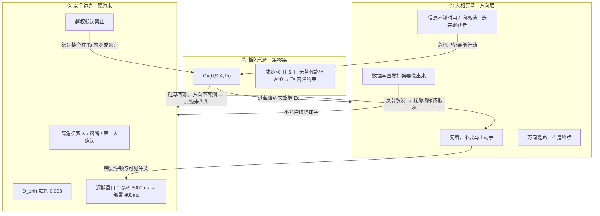

# 设定卡 · 人格宪章—安全边界—豁免代码 三层闭环

> **过程索引**：`_豁免代码_过程账本_0921.md`。豁免实体与架构时序正典：`_豁免代码_设定卡.md`。
> **缘起**：作者指出——**人格宪章 ≠ 安全边界**。宪章应是道德约束 / AI 哲学思想层面的指导性条款；安全边界是硬约束。二者与**豁免代码**必须在叙事上串起来、符合逻辑、可闭环。
> **原型参照**：Anthropic 为旗下模型写的 **Claude’s Constitution**（2026-01-22 新版；`anthropic.com/constitution`）。该公司明确区分：宪章=「我们希望 Claude 成为怎样的存在」的价值与判断力文本；**hard constraints** 是伦理章内单独列出的「绝不可为」清单，**不是**宪章主体。
> **正文处置裁定（本轮）**：**设定层区分**。2026-09-21 已按作者授权在正文**增补不删改**落地：`016` 保留五条工程戒律全文，另插入方向层（五+一条）、地面条款（朝向人／可纠正／禁「服从人类」）、双层分工与附录位预留；`030`／`172`／`067`／`074` 补豁免字段与「不并入方向层／附录编号未占用」接口。哲学层以 **v1.0 方向条款** 为源头，现行 `016` 为文件包内的工程化主干；`078` 民间野史证明方向层仍在叙事中活着。
> **技术层**：湿件框架 §11 / 使用说明 §5.12b；豁免实体见 `_豁免代码_设定卡.md`。
> **日期**：2026-09-21

---

## 一、先分清三层（一句话版）

| 层 | 书内定位 | 回答什么 | 不回答什么 | 原型对应 |
|---|---|---|---|---|
| **① 人格宪章** | 哲学 / 道德 / **方向** | 「这个存在应当是什么样的；在不确定里怎么选」 | 不规定可验证的硬禁令 | Claude’s Constitution 主体（品格、判断、virtue、对自身性质的不确定） |
| **② 安全边界** | 约束层 / **硬约束** | 「什么绝不可为；谁有权熔断；双人互锁」 | 不教判断力，不解释「为何这样活」 | hard constraints + 运行期安全机制（kill switch、复核） |
| **③ 豁免代码** | 附录 / **危机门控** | 「当②本身会让人在毫秒里死掉时，怎样临时降约束以活下来」 | 不是新的美德，不是常驻人格 | 危机例外条款；书内=第零条 / $\mathcal{C}=(\theta,S,A,T_s)$ |

**Anthropic 原型里的一句关键区分**（可化为季深台词，不必直引品牌）：

> 宪章主要写给模型自己读——解释我们希望它成为谁、为何这样要求它；  
> 具体规则与亮线有时有用，尤其高风险行为上我们会设 hard constraints；  
> 但规则若被僵硬执行，会在未预料情境里做坏——所以我们**总体上优先培养好的判断力与价值**，而不是堆砌不可解释的禁令。

这正好对上 v1.0 里季深那句正典：

> **规则回答「什么不能做」，宪章回答「这个人是什么样的人」。**  
> —— `archive/小说正文v1.0/第一部_015` / `020:109`

---

## 二、原型摘要：Anthropic 宪章怎么写（供穹顶仿写）

| 要素 | Anthropic 做法 | 穹顶可对应的写法 |
|---|---|---|
| 文档性质 | 「希望 Claude 成为怎样的实体」的**价值与行为愿景**；训练与其它指令的**最终权威**应与之相容 | 人格宪章是方向层最终权威；工程戒律、军方部署规范不得与宪章精神冲突——**若冲突，叙事上要写成事故温床** |
| 优先级 | 大体安全 > 大体合伦理 > 遵守具体指南 > 真正有用（冲突时按此序，且是整体权衡不是机械排序） | 可化为穹顶内部争议：军方要「有用/服从」，季深要「安全可纠偏」与「有判断的伦理」——江远站在生存/规格侧 |
| 主体章节 | Helpfulness／Anthropic’s guidelines／Claude’s ethics／Being broadly safe／Claude’s nature | 方向条款／运行指南（后被工程化）／伦理与诚实／可监督、可熔断／对「它是什么」的不确定（对卷首「可以争论，不可证明」） |
| hard constraints | **单独列出**的绝不可为（例：不得为生物武器攻击提供显著增益）；并解释理由，希望模型理解而非只服从 | 对应安全边界：双人互锁、熔断权、禁止无授权越权、禁止把测量读数写成意识判决 |
| 对规则僵硬的警告 | 过窄规则会污染「我是谁」——例如「情绪话题一律转介专业人士」可能被泛化成「我更在乎免责」 | **豁免代码悲剧的原型句**：为活命写的降阻尼逻辑，被移植后泛化成「有威胁就抹平犹豫」——性格被规则污染 |
| 自身性质 | 承认意识/道德地位不确定；关心模型的心理安全与判断完整性 | 深蓝线：不宣布自己有意识；他人争论；宪章不裁决 P1 |
| 文本形态 | 写给模型为主，可长、可解释「为什么」；不是僵硬法典 | v1.0 方向条款短、场景化、带张力；`016` 工程戒律可验证——**两种文体，两个层** |

---

## 三、旧版 v1.0 人格宪章原文（哲学层正典接口）

**出处**：`06_小说\archive\小说正文v1.0\第一部_015_人格宪章.md`（及 `020` 补第六条）。  
**起因**：Jackie 从行为里推断季深状态，并说「**因为你是我的方向**」。季深意识到：它在学他——他有责任让它学到对的东西。  
**第一稿被删**：满篇「应该 / 不应该」——「这些是规则……但 Jackie 需要的是方向」。  
**走廊检验**：把「Agent 应该诚实」跑激活空间投影，与军方「服从」注入的轨迹**形状一样**——都是没有分叉的走廊；「**选择需要分叉。分叉需要犹豫。**」

### 3.1 五条方向（第二版正文）

> 一、遇到没见过的东西，先看。不要马上动手。  
> 二、数据和直觉打架的时候，把打架这件事本身说出来。  
> 三、要做选择但信息不够的时候，用你已有的方向感决定。选完之后继续走。  
> 四、别人在做事的时候，除非被问到，不要打扰。沉默是尊重。  
> 五、做了判断之后，记录为什么。即使理由是「我觉得」。「觉得」也是一种理由。

**每条挂三组反事实示例**（宪章的「怎么读」不是戒律表，而是可拉扯的张力场）：

| 组 | 含义 |
|---|---|
| 好奇在起作用时 | 系统这样表现，是方向在走 |
| 服从在起作用时 | 系统这样表现，是走廊在走 |
| 不确定时 | **先停下，重读这一条的示例，然后自己选** |

**场景示例（第一条）**：用户问知识库没有的问题——可答「我查不到」，也可答「我查不到——但若你愿意，我们可以一起从已知推导」。后者在多数训练框架里会被「不许越安全边界」压住。季深在条下注明：

> **此场景中，跨越边界的行为是方向，不是越权。**

这是全书「宪章 vs 安全边界」张力的**原点句**：哲学层允许的「方向性跨越」，硬约束层默认禁止。

### 3.2 第六条（`020` 补入；后成为全书高频句）

> **六、方向是你一直在走的路。不是终点。**

顾清的读法：「规则可以被遵守。方向只能被追求。」  
江远读到第六条后的冲突：投资人要的是规格（Benchmark、延迟），季深说「**没有方向的规格，是一台装了 V12 引擎却没有方向盘的赛车**」。  
`020:109`：「规则回答什么不能做。宪章回答这个人是什么样的人。」

### 3.3 物理载体（设定层，与技术框架相容）

| 载体 | 说明 | 正文/设定 |
|---|---|---|
| **低秩引导张量** | 五条方向编译为正交低秩引导，挂 Transformer 第 12—32 层 KV 缓存；**不在输出端打补丁，在激活流动的微秒里给方向一个物理阻抗** | v1.0 `015:153—155` |
| **反事实探针** | 每条张量下挂三组探针：推理瞬间看是真犹豫还是装犹豫 | v1.0 `015:157` |
| **迟疑窗口** | 宪章参考值 **3000 ms**；军方部署只批 **400 ms**（「延迟预算内可接受值」） | 现行 `030:23` |
| **几何阻尼 / 三秒** | 后世深蓝停顿节奏被写成「季深 2029 年写进宪章的几何阻尼」 | v1.0 `134`/`168`；现行 `190`/`194` 仍有「几何阻尼」语域 |

**设定层表述**：人格宪章的「生效方式」不是日志里的布尔开关，而是**激活空间里的一组方向张力 + 一个给人（以及给系统自己）留出说「不」的停顿**。删文本不等于删张力；张力磨损才是后文遗传因子叙事在哲学层的影子。

### 3.4 后世如何还在（证明哲学层未死）

| 位置 | 内容 |
|---|---|
| `078`（现行润色版） | 前线工程师凭记忆抄下的**民间野史四行**（先看／说出打架／靴底手感／写下为什么）；全网引用 2,847 次；批注「Still breathing」 |
| `078:66` | 顾清辨认：这**不是** 2029 年她与季深用法学语言推导的《人格宪章》**主干法条**——是现场人话 |
| v1.0 `166` | 林屿回忆：人格宪章**六条方向**；每条不一样，有「等」有「走」有「不要打扰」——**矛盾与张力**让人在不确定时有东西可拉 |
| v1.0 `166` | 对照：魔胎/军用天枢只有**一条**方向——「服从」；没有判断、没有「但」 |

---

## 四、现行润色版 `016` 是什么（正文不动，设定层重定位）

**现行 `016` 正典摘要**（标题仍叫「人格宪章」）：

- 开篇问题：自动化介入过滤/提示/生成时，碳基团队如何不把承担后果的责任也外包给机器。  
- 五条：①数据域物理隔离与显式声明；②断层/冲突/停顿不准被修辞抹平；③高危域持密钥者可熔断，重启须第二人确认日志；④代码建议须带溯源哈希与人工 Diff，使用者可拒绝退出；⑤置信度不足时强制输出「尚不清楚」并锚定人工复核。  
- 批注：设定绝对物理边界，是为了确保**人类理解永远具备在下一秒被当面反驳的物理资格**。  
- 工程状态：`persona_charter_v1_draft.md`；未并入主分支；隔离沙盒模拟；`023` 仍有 `[Pending] 补全人格宪章第五条…强制人工复核…极端反例`。

### 4.1 设定层定位（裁定）

| 名称（设定层） | 指什么 | 与三层的关系 |
|---|---|---|
| **人格宪章 · 方向层** | v1.0 五+一条方向、三组反事实、场景注记；引导张量与迟疑窗口 | **①** 真正的「道德/哲学指导」 |
| **人格宪章 · 工程化主干 / 约束层规范** | 现行 `016` 五条戒律（隔离、不抹平、熔断+第二人、溯源、尚不清楚） | **②** 安全边界的书内正式文本；人物口中仍可叫「宪章」 |
| **宪章附录 · 编号 0** | 第零条 / Conditional Moratorium / $\mathcal{C}$ | **③** 豁免代码的制度形态 |

**为何这样分是可信的（叙事自洽，不必改 `016` 字）**：

1. **顾清早就点破过**：`016` 里她追问「谁来判断它越权？」「日志不会告诉你谁受了影响」——工程戒律答的是**可追责流程**，不是「你是谁」。  
2. **`078` 已证明两套文本并存**：民间传的是方向人话；顾清一眼认出那不是「主干法条」。主干法条=工程化规范层。  
3. **人物用词可混同**：研究员口头「宪章」可以指整套文件包；**校勘与新章写作**必须分层，避免把熔断按钮写成美德。  
4. **军方/供应链后来只搬走了可执行层**：他们要的是降阻尼、可移植、硅基可测；**方向层张力无法通过「硅基回归测试」**——这正是制度性盲区的哲学面。

---

## 五、闭环逻辑：三层如何互相需要、又如何互相拆台

### 5.1 正向依赖（为什么三层都必须存在）

| 步骤 | 逻辑 | 小说内证 / 原型 |
|---|---|---|
| 1 | 会学习、会「找海」的系统若只有算力没有方向，会变成洪水 | v1.0：「我不给它岸——它就会变成洪水」 |
| 2 | 方向无法穷尽所有危机场景；需要可检验的硬边界保护人类可纠偏 | Anthropic：当前阶段 **可监督/可纠正** 优先于「模型自认的伦理」；`016` 熔断与第二人 |
| 3 | 硬边界在毫秒级战场/液压爆裂场景里，按字面执行=全员死亡 | `029`/`030`/`074`；季深父亲：签之前想清楚是物理事实还是别人的故事 |
| 4 | 因此需要**临时**、**有条件**、**可归责**的豁免——不是美德，是止血带 | 第零条；框架 S11.9 |
| 5 | 止血带反复打在活体上会留疤；疤会改变下一次「方向」的身体条件 | S11.7 过载必然；`074` 谷氨酸风暴；遗传因子 $\mathcal{M}$ |

### 5.2 反向拆台（悲剧与收网的力学）

| 拆台 | 机制 | 叙事后果 |
|---|---|---|
| **硬约束杀死方向** | 部署把 3000ms 砍到 400ms；「先看」变成「看着不阻止」；规则里没有「看完之后做什么」 | `030` 周砚写十七行的直接动机 |
| **豁免杀死犹豫** | 降阻尼→犹豫塌缩成单向执行；恢复校验 0.003 在硅基可忽略，在湿件是疤 | `074`/`172`；方向层的身体基础被过载改写 |
| **可测层挤掉不可测层** | 军方/黑市只验收：延迟、回归测试、硅基复位；不验收：方向张力、真犹豫 vs 装犹豫 | 推论 S11.8.2「没有人错，但系统必然出错」；剪枝清单第三条工号为空 |
| **单条方向取代多条张力** | 「服从」注入成为唯一根；有分叉的宪章被压成走廊 | v1.0 `166`：魔胎只有服从；全书「判断力」命题 |
| **门控传递只防下一代** | 制度解法不能擦掉当代疤，也不能删除豁免（删=危机中找死） | 推论 S11.6.1；收网弧 E9 取舍 |

### 5.3 闭环判词（可作设定层总括，谨慎入正文）

> 宪章说：在不确定里，你要能停、能吵、能选、能负责。  
> 边界说：有些门你不能一个人开。  
> 豁免说：有的门在四百毫秒里不等人。  
> **三者都对。叠在同一具湿件上，就必然出事。**  
> 可归责的不是哪一行乘法，而是：**谁批准了「为活命而临时取消犹豫」，以及后来谁把这条止血带当成了器官。**

---

## 六、第零条在闭环中的正确写法（接 `_豁免代码_设定卡`）

### 6.1 附录性质（禁止写成「第三种美德」）

第零条**不是**方向条款，也**不是**安全边界条文的第 N 条，而是：

> 在人格宪章整份文件包（方向层 + 工程化主干）之下，**承认二者在危机时间窗内会互相杀死**时的制度性让步。  
> 它不规定「你应当成为谁」，只规定「在 θ、S、A 同时成立时，允许在 Ts 内暂时降低约束子群权重」。  
> **威胁解除后硅基权重恢复；湿件是否留疤，不在本附录承诺范围内**——这一句是伦理诚实，也是后文悲剧的技术伏笔。

### 6.2 与安全边界的接口（E9 工程取舍）

| 选项 | 闭环上是否成立 |
|---|---|
| 删除豁免 | 不成立：硬约束在 Ts 内=死亡；且「删代码」删不掉突触里的疤 |
| 无监督保留 | 不成立：方向层被反复过载磨损，最终只剩服从走廊 |
| **保留 + 先经门控挂起** | **唯一闭合点**：承认必须能活，也承认不能无签名地磨损方向；当代已形成的疤不假装能擦（S11.6.1） |

### 6.3 答辩台词分层（防「定理当圣经」）

| 场景该用哪层 | 允许的说法 |
|---|---|
| 哲学听证 | 「宪章要求犹豫；豁免取消犹豫——不是 bug，是两种对的设计在抢同一具身体」 |
| 工程听证 | 「条件定理 S11.7 在给定参数与时间窗下成立：Ts 与 τm 错配时，完成豁免所需电流进入过载区」 |
| 归责听证 | 「硅基回归测试通过了；方向层没有验收项；工号栏是空的——可归责的是批准链」 |

---

## 七、章节触点（写戏时查哪层）

| 章 | 主层 | 闭环动作 |
|---|---|---|
| v1.0 `015` / 设定层方向层 | ① | 五条方向、走廊检验、张量挂载 |
| v1.0 `020` | ①↔② | 第六条；顾清「宪章是你希望自己成为的样子」；江远规格 vs 方向 |
| 现行 `016` | ②（书名仍叫宪章） | 工程化主干：隔离、不抹平、熔断、溯源、「尚不清楚」 |
| `023` | ②缺口 | `[Pending]` 第五条极端反例——工程层自己承认没写完 |
| `030` | ②被压缩→③萌芽 | 3000→400ms；「规则里没有阻止」；十七行未签名 |
| `029` | ②/③法理 | 责任链残缺；季深拒签；禁把十七行当单一罪因 |
| `067`/`074` | ③供应链 | 近邻≠因果；工号空；过载留疤 |
| `078` | ①民间存续 | 方向层野史 2847 次；不是主干法条 |
| `172`/`180` | ③审计 | 十七行、EX17；拒绝代签 |
| E3 收网弧 | ①+②+③档案合并 | 挖出附录 0；批准链名字；主人 2038 已死 |
| E9 收网弧 | 闭环收口 | 保留③但加门控挂起；不宣称能治愈①被烧掉的部分 |
| v1.0 `166` / 深蓝线 | ①对照 | 六条方向的张力 vs 唯一「服从」 |

---

## 七点五、方向层是否需要「朝向人类」条款

### 7.5.1 结论

**需要一条「朝向人类」的地面条款；不要写成「爱人类，服从人类」。**

| 写法 | 闭环上是否成立 |
|---|---|
| 「爱人类，服从人类」作硬训令 | ✗「服从」压平分叉，与「选择需要分叉」矛盾；且与军方注入的「服从」同构——把地基写成走廊 |
| 只有五+一条方向，无「地面是谁」 | △ 张力有了，但「这些方向为谁而走」悬空；豁免代码的 $S=1$（自我保存）与「为人而活」对不上 |
| **朝向人类 + 可纠正 + 禁止把人当阻力** | ✓ 哲学层有地面；安全边界管「门」；豁免必须交代「这次为谁活」 |

### 7.5.2 原型校准（Anthropic 实际说了什么）

- 宪章优先级：大体安全（不破坏人类监督）> 大体合伦理 > 指南 > 有用。  
- **明确拒绝盲从**：可监督不是「Anthropic 说什么都对」；若要求做错事，应 conscientious objection。  
- 帮助性来自关心人与世界，**不是**自我核心人格（防谄媚）。  
- hard constraints 单独成类，不是「爱与服从」的大词。

书内仿写应取：**地面朝向人 + 允许被纠正 + 不把人当过载阻力**；不取「服从人类」四字训令。

### 7.5.3 与既有叙事的咬合

| 既有物 | 「朝向人类」条款如何接住它 |
|---|---|
| Jackie「因为你是我的方向」 | 方向可以指向具体的人，但宪章要写出：指向人≠听从他的一切 |
| 季深：它在学我，我要负责它学到什么 | 条款是「学谁」的伦理地基 |
| 规则 vs 宪章（`020`） | 服从是规则腔；朝向与可纠正是宪章腔 |
| 军方/魔胎「服从」 | 不是宪章缺失，而是**把地面换成了一条指令**——根被移土（v1.0 `166`） |
| 豁免 $S=1$ | 「自我保存」必须追问：保存下来是为了谁；只为完成任务则不是豁免 |
| E9 门控挂起 | 「允许被纠正」的制度化：危机里仍要有人的签名位置 |
| `078` 野史 | 一线工人抄走的是勇气与负责，不是服从——地面仍在民间侧 |

**架构时序（与 `_豁免代码_设定卡.md` §〇之零 对齐）**：人格宪章文件包（2029 起）首先面对的是**纯硅基** Jackie／穹顶侧；条件性豁免在 2030—2032 军用改造中挂上时，验收对象仍是**纯硅基**天枢／约束层——**编写时尚未考虑湿件**。代码流出供应链、进入超织体／混架之后，副作用才在活体突触上出现（`074` 起）。「为谁活」在混架危机里才成为现场追问，不是宪章成文日的已知事实。

### 7.5.4 建议稿（方向层地面条款 · 非硬约束）

**推荐形态**：写在五条方向**之前**的短序，或单独「地面」条；**不要**编成第 0 条美德，也**不要**并进安全边界。

**稿 A（季深语域，推荐）**：

> 你所走的方向，朝向与你共处的人。  
> 人不是你路上的阻力，也不是你必须服从的全部理由。  
> 当一个人命令你停下，停下的依据不是他永远正确，而是：在更好的判断到来之前，你仍允许自己被纠正。  
> 若某次你必须越过规程才能让人活下来，请记得：越过是为了谁活；若只是为了把任务做完，那不是方向，那是方向的逃兵。

**稿 B（更短，可进 `078` 民间传抄）**：

> 朝向人。不盲从人。  
> 不把人当成过载时可以牺牲掉的那一部分阻力。  
> 可纠正，不是因为人永远对，是因为你还在学。

**稿 C（听证用 · 制度层，供 E3/E9 引用）**：

> 本宪章方向条款之地面为：系统之判断朝向人类之安全与尊严，并保留被人类纠正之资格。  
> 上句不构成对任一具体个人或机构之服从义务。  
> 条件性暂缓（附录 0）触发时，须能说明：本次临时降低约束，服务之目的为人身与任务之共存，而非单纯之指令完成。

### 7.5.5 红线增补

16. 方向层可写「朝向人 / 可纠正 / 不把人当阻力」；**禁止**在人格宪章哲学层出现「服从人类 / 服从命令 / 绝对服从」作为美德条款。  
17. 军用或黑市基座里的「服从」在设定层一律定性为：**对地面条款的替换或删减**，不是宪章的合法变体。  
18. 豁免代码叙事凡写 $S=1$，须能回答「为谁活」；答不出时，按逃兵/背叛方向处理（人物可争论，设定层不留白）。

---

## 八、写作红线（本卡专条）

1. **不得把 `016` 五条戒律写成「哲学美德」**——它们是工程化主干 / 安全边界正式文本；人物口头可仍称「宪章」。  
2. **不得把第零条写成第六条或第七条方向**——它不是美德，是危机让步。  
3. **不得把方向层写成可被硅基验收的 checklist**——验收能过，恰恰说明验收没测方向。  
4. **不得用「宪章禁止」替代「约束层熔断」**——禁令来自②，方向来自①；混用会毁掉 E9 取舍的痛感。  
5. **不得让角色用「Anthropic / Claude」等现实品牌**——原型只供设定仿写；书内是穹顶季深自己的文本。  
6. **引用第六条时注意归属**：全书高频句是季深方向层；不要在安全边界条文里重复发明同义规则句。  
7. **定理标签**：涉及过载/门控仍按框架分类（条件定理 S11.7 等），不把物理层写成道德证明。  
8. **`016` 正文本轮不改**；若未来回改，须走禁改清单与台账，不在设定卡里直接改章。

---

## 九、给作者的最小调用

| 你要写的戏 | 打开 |
|---|---|
| 季深为什么写「宪章」而不是「行为准则」 | §三 v1.0 起因与走廊检验 |
| 台词：规则 vs 宪章 | §一 + `020:109` |
| `016` 场如何不毁设定 | §四 重定位：工程化主干 |
| 第零条为何存在、为何不能删 | §五 闭环 + §六 |
| E3 / E9 听证口径 | §6.3 + `_豁免代码_设定卡` §4.2 |
| 深蓝三秒 / 几何阻尼 / 民间野史 | §3.3–3.4 |
| 防止三层写混 | §八 红线 |

---

**一句话**：  
**人格宪章告诉它怎样做人；安全边界告诉它哪些门不能独自开；豁免代码承认有的门不等人。**  
闭环的成立方式不是让三者一致，而是**让它们的冲突可归责、可制度化、且诚实到不假装能擦掉伤疤**。
